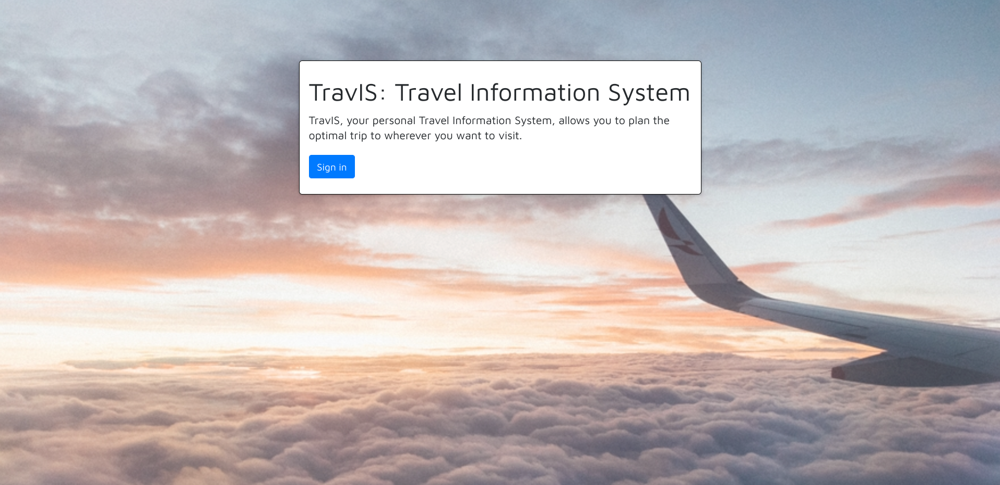
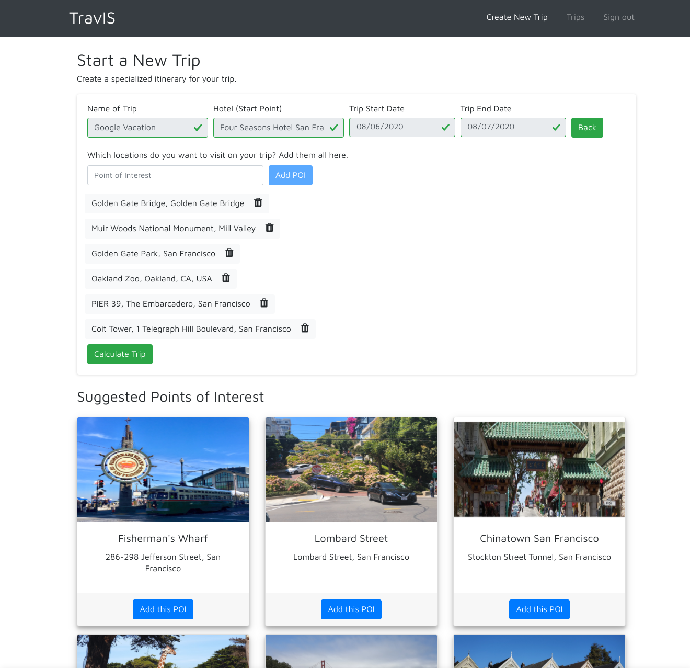
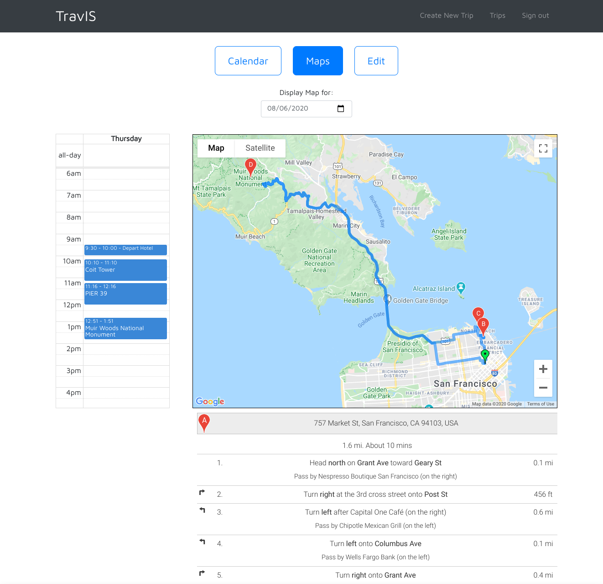
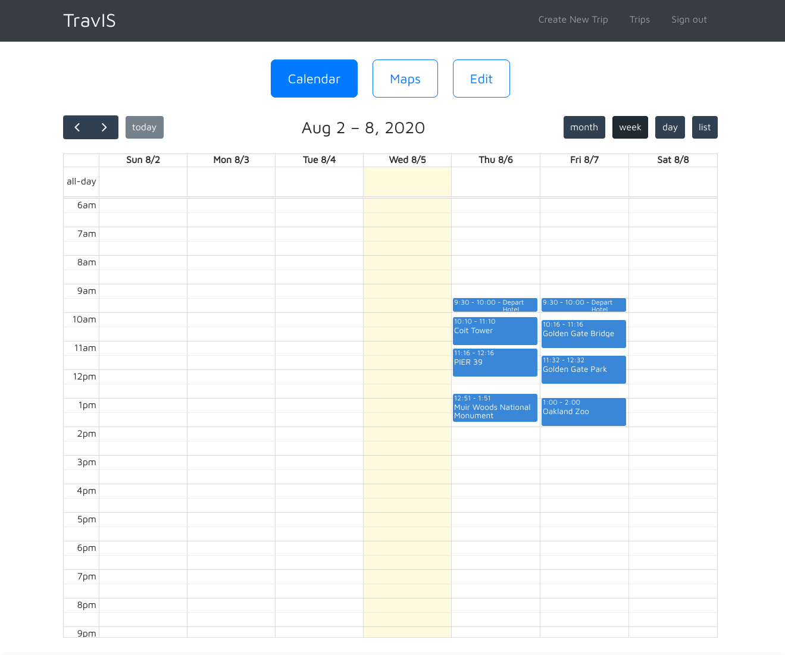
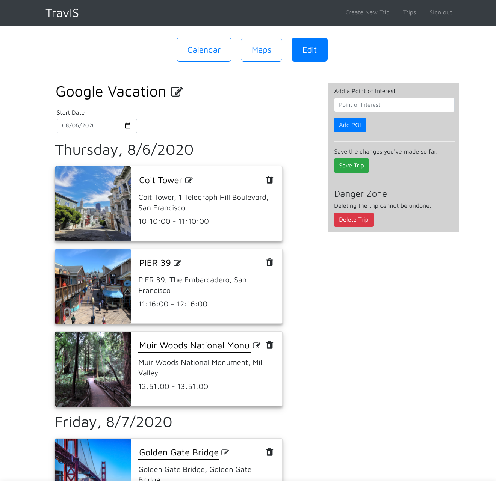
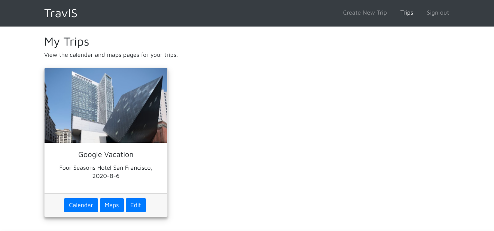

# TravIS: Travel Information System
### Google STEP Capstone Project

This is the Google STEP capstone project by Chris, Adam, and Eshika. 
TravIS, the **T**ravel **I**nformation **S**ystem, is meant to facilitate travel planning, allowing you to plan the optimal trip.

Visit the website at http://offroad-pod-step-2020.appspot.com. (Note: This link may become defunct at some point.)

## Main Features
1. Create a new trip by adding a destination (hotel), start and end dates, and points of interest (POIs) they would like to visit. TravIS will calculate the optimal route and itinerary for the user's trip.
    - TravIS will also provide suggested points of interest based on the user's destination.
2. View the itinerary and route directions for each day through an embedded Google Maps widget on the Maps page.
3. See the overall trip schedule, event address and opening / closing hours, and different calendar views on the Calendar page.
4. Edit the trip details, including the trip name, event names, and adding or deleting POIs on the Edit page. *
5. Access all of the trips under the current user, and the Maps, Calendar, and Edit pages, on the Trips page.

Note: All of the features above require the user to sign in first.

\* This feature was still a work in progress by the end of the internship, and is not implemented in the final version.

## TravIS Screenshots
### Sign In Page

### Create a New Trip

### Maps Page

### Calendar Page

### Edit Page *

### Trips Page

\* This screenshot of the Edit page is not accessible through the master branch (those changes were not merged).

## Tools and Languages Used
TravIS was built with Java, JavaScript, and HTML/CSS with Bootstrap using the Google App Engine Platform.
